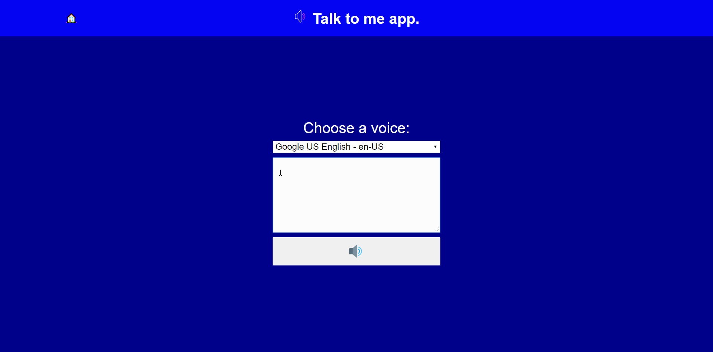

# Text reader app.

Simple text reader app.

Write the text in the textarea, choose a voice and hear.

## No framework
Realized using basic HTML CSS and Vanilla Javascript.


## Usage
```
Open 'index.html'.
```

## Contributing
Pull requests are welcome. For major changes, please open an issue first to discuss what you would like to change.

Please make sure to update tests as appropriate.

## Author
@alexPaper 

## License
[MIT](https://choosealicense.com/licenses/mit/)